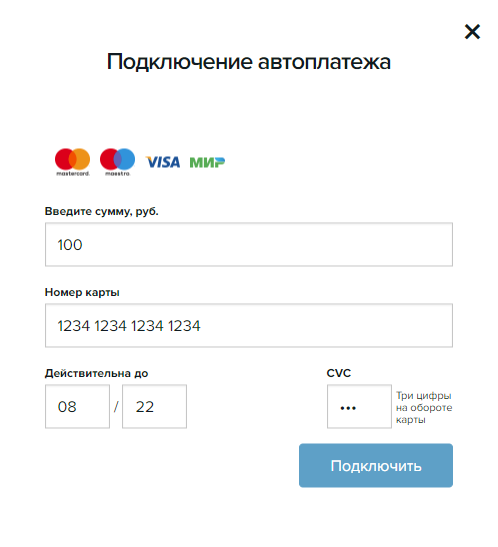

# Как подключить автоплатеж 

**Автоплатёж** — это сервис, который позволяет освободить время от рутинной оплаты счетов за разные услуги.

## Что можно оплачивать с помощью автоплатежа в [Novabank](https://www.novabank.ru)

* Сотовая связь: Настройте автоплатёж, чтобы забыть о дате списания и всегда оставаться на связи.
* Услуги ЖКХ, интернет и ТВ: Один раз настроив график оплаты регулярных услуг, можно следить только за итоговым счётом раз в месяц.
* Кредиты в других банках: Автоплатёж поможет избежать просрочек. Выберите дату за несколько дней до обязательного платежа, учитывая возможные задержки транзакции.

